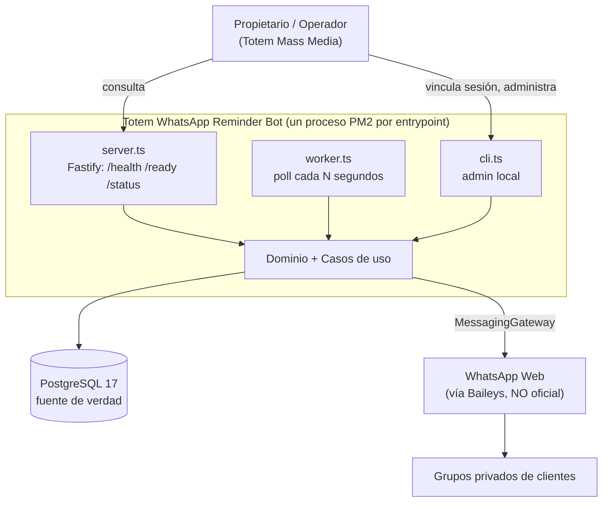
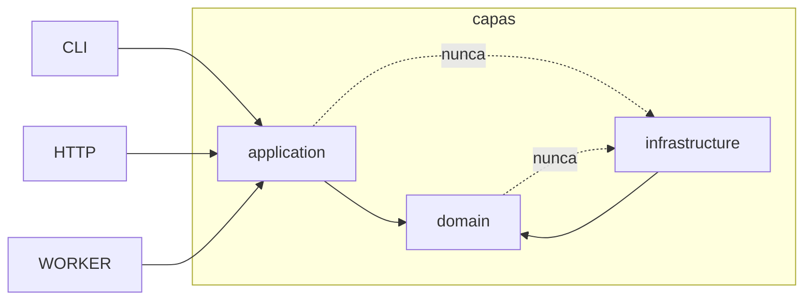
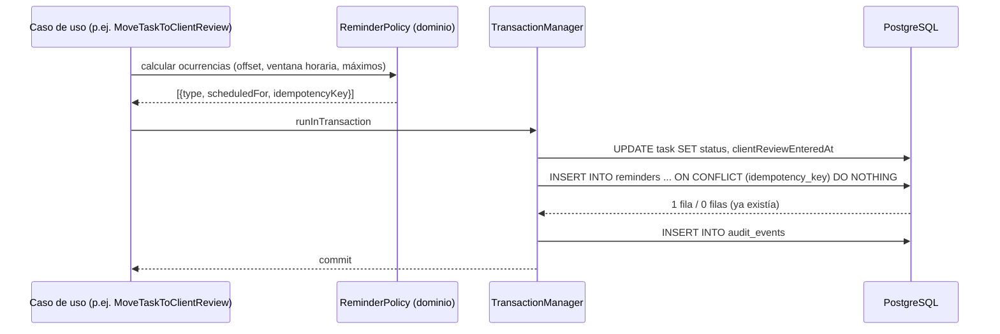

# ARCHITECTURE.md

## 1. Contexto

Sistema interno, un solo despliegue, un solo tenant. Tres puntos de entrada
(`server`, `worker`, `cli`) sobre un mismo núcleo de dominio y una sola base de datos
PostgreSQL. La integración con WhatsApp es un detalle de infraestructura reemplazable.



## 2. Estructura de carpetas

```text
src/
  domain/                  # puro. Sin I/O, sin librerías externas salvo tipos.
    entities/              # Client, WhatsAppGroup, Recording, Task, Invoice, Reminder...
    value-objects/         # ReminderType, IdempotencyKey, GroupJid, BusinessTime...
    events/                # eventos internos del dominio
    errors/                # errores tipados
    ports/                 # interfaces (MessagingGateway, *Repository, Clock, ...)
    services/              # reglas puras: elegibilidad, ventanas horarias, backoff
  application/             # casos de uso. Orquesta puertos. Sin detalles técnicos.
    use-cases/
    dto/
  modules/                 # composición por área funcional (wiring + API pública)
    clients/
    whatsapp-groups/
    recordings/
    tasks/
    billing/
    reminders/
    messaging/
  infrastructure/
    database/              # Prisma client, repositorios, TransactionManager, mappers
    whatsapp/              # BaileysMessagingGateway, FakeMessagingGateway, auth store
    scheduling/            # bucle del worker, claim, backoff
    logging/               # Pino, redacción, correlationId
    http/                  # Fastify, rutas de salud
  shared/                  # utilidades sin dependencia de dominio (result, time, guards)
  config/                  # carga y validación de env con Zod. ÚNICO lugar con process.env
  cli/                     # comandos administrativos
  app.ts                   # composition root (construye el contenedor de dependencias)
  worker.ts
  server.ts

prisma/                    # schema.prisma + migrations
tests/
  unit/  integration/  e2e/
docs/
```

Cambio respecto a la propuesta inicial: `domain/` y `application/` se elevan por encima de
`modules/`, y `modules/` pasa a ser la capa de **composición** por área. Esto elimina la
ambigüedad de tener entidades duplicadas dentro de cada módulo y a la vez en `domain/`.

### Reglas de dependencia



Se verifican con una regla ESLint `no-restricted-imports` por capa (tarea M1-05).

## 3. Puertos

| Puerto                | Responsabilidad                                                            | Adaptadores                                                                             |
| --------------------- | -------------------------------------------------------------------------- | --------------------------------------------------------------------------------------- |
| `MessagingGateway`    | `sendGroupText(jid, text, opts): Promise<SendResult>`, `connectionState()` | `BaileysMessagingGateway`, `FakeMessagingGateway`, `DryRunMessagingGateway` (decorador) |
| `ReminderRepository`  | consultar vencidos, **claim atómico**, marcar enviado/fallido/cancelado    | Prisma                                                                                  |
| `TaskRepository`      | leer tarea y su estado dentro de la transacción de envío                   | Prisma                                                                                  |
| `RecordingRepository` | leer/programar grabaciones                                                 | Prisma                                                                                  |
| `InvoiceRepository`   | leer facturas y su estado de pago                                          | Prisma                                                                                  |
| `ClientRepository`    | cliente + grupo primario habilitado                                        | Prisma                                                                                  |
| `Clock`               | `now(): Instant`, zona horaria de negocio                                  | `SystemClock`, `FixedClock` (tests)                                                     |
| `IdGenerator`         | `next(): string` (UUID v7)                                                 | `UuidV7Generator`, `SequentialIdGenerator` (tests)                                      |
| `TransactionManager`  | `runInTransaction(fn)` con acceso a repos transaccionales                  | Prisma `$transaction`                                                                   |
| `AuditLogger`         | registrar `AuditEvent`                                                     | Prisma                                                                                  |

`DryRunMessagingGateway` envuelve al gateway real y corta el envío: permite ejercitar todo
el flujo de producción sin emitir mensajes.

## 4. Flujo: programación de un recordatorio



Programar es **idempotente por construcción**: la clave única de la BD es la garantía, no
una comprobación previa en Node.

## 5. Flujo: envío de un recordatorio

```mermaid
sequenceDiagram
    participant W as Worker (tick)
    participant R as ReminderRepository
    participant DB as PostgreSQL
    participant E as EligibilityService (dominio)
    participant T as TemplateRenderer
    participant G as MessagingGateway

    W->>R: claimDueReminders(limit, lockTimeout, now)
    R->>DB: UPDATE reminders SET status='CLAIMED', claimed_at=now, claimed_by=workerId<br/>WHERE id IN (SELECT ... FOR UPDATE SKIP LOCKED) RETURNING *
    DB-->>W: lote reservado
    loop por recordatorio
        W->>DB: BEGIN
        W->>E: revalidar (estado entidad, cliente activo, grupo, pausa, ventana, máximos)
        alt no elegible
            W->>DB: UPDATE status='CANCELLED'/'SKIPPED', cancellation_reason
            W->>DB: COMMIT
        else elegible
            W->>DB: INSERT message_attempt (status='STARTED') ; UPDATE status='PROCESSING'
            W->>DB: COMMIT
            W->>T: render(plantilla, variables validadas)
            W->>G: sendGroupText(jid, texto)
            alt éxito
                W->>DB: UPDATE reminder status='SENT', sent_at ; attempt='SUCCESS', provider_message_id
            else error transitorio y attempts < max
                W->>DB: UPDATE status='RETRY_SCHEDULED', next_attempt_at=backoff ; attempt='FAILED'
            else error permanente o max alcanzado
                W->>DB: UPDATE status='FAILED', last_error ; attempt='FAILED'
            end
        end
    end
```

Puntos clave:

- El `INSERT` de `MessageAttempt` se **commitea antes** de llamar a WhatsApp. Así queda
  evidencia persistente de que hubo un intento aunque el proceso muera a continuación.
- `FOR UPDATE SKIP LOCKED` permite varios workers sin contención ni doble envío.
- La revalidación de elegibilidad ocurre en el momento del envío, no en el de programación.

## 6. Fallos y recuperación

| Fallo                                                       | Detección                                                    | Recuperación                                                                                                                                                                                                 |
| ----------------------------------------------------------- | ------------------------------------------------------------ | ------------------------------------------------------------------------------------------------------------------------------------------------------------------------------------------------------------ |
| Worker muere tras `CLAIMED`                                 | `claimed_at` más antiguo que `REMINDER_LOCK_TIMEOUT_SECONDS` | El siguiente tick lo vuelve a reclamar                                                                                                                                                                       |
| Worker muere **entre** el envío y el `UPDATE status='SENT'` | Existe un `MessageAttempt` en `STARTED` sin desenlace        | El recordatorio pasa a `NEEDS_REVIEW` vía `cancellation_reason='UNCERTAIN_DELIVERY'` y **no se reintenta automáticamente**; requiere decisión del operador. Ver `docs/REMINDER_ENGINE.md` § entrega incierta |
| BD caída                                                    | `/ready` falla, worker registra y espera                     | PM2 mantiene el proceso; reintento en el siguiente tick                                                                                                                                                      |
| WhatsApp desconectado                                       | `connectionState() !== 'open'`                               | El tick no reclama nada; alerta en `/status`; re-vinculación `OWNER_REQUIRED`                                                                                                                                |
| Sesión de Baileys invalidada (logout remoto)                | evento `connection.update` con `loggedOut`                   | Se detiene el envío, se marca la sesión inválida, se notifica al operador                                                                                                                                    |
| Doble worker por error de despliegue                        | Diseño lo tolera                                             | Claim atómico + clave única                                                                                                                                                                                  |

**Preferencia explícita: no duplicar antes que no perder.** Ante entrega incierta se prefiere
un mensaje no enviado y revisado por un humano, frente a un mensaje duplicado al cliente.

## 7. Persistencia

PostgreSQL 17 + Prisma. Detalle en [docs/DATABASE_DESIGN.md](docs/DATABASE_DESIGN.md).
Decisión de modelado de `Reminder` frente a distintas entidades origen:
**campos opcionales con restricciones `CHECK`** (una sola tabla, FKs reales, exactamente
un origen no nulo). Justificación en [docs/adr/0005-idempotent-reminders.md](docs/adr/0005-idempotent-reminders.md).

## 8. Decisiones pendientes

- Procesamiento de mensajes entrantes para confirmaciones (SPEC Q-02).
- Estrategia de almacenamiento de la sesión de Baileys: archivos con permisos restrictivos
  (MVP) vs. store en PostgreSQL cifrado (evaluar en M4).
- Migración futura a BullMQ: solo si el volumen o los requisitos de latencia cambian
  (ADR-0003 define el criterio de disparo).

## 9. Riesgos arquitectónicos

| Riesgo                                            | Impacto              | Prob. | Mitigación                                                                                                |
| ------------------------------------------------- | -------------------- | ----- | --------------------------------------------------------------------------------------------------------- |
| Baileys deja de funcionar por cambio de protocolo | Alto                 | Media | Puerto `MessagingGateway`; plan B WhatsApp Cloud API                                                      |
| Baneo del número                                  | Alto                 | Media | Número secundario, volumen bajo, solo grupos propios, horario comercial                                   |
| Baileys 7.x en release candidate                  | Medio                | Alta  | Fijar la línea `6.7.x` (`legacy`) en M4 y reevaluar en el GA de 7.0                                       |
| Deriva de hora por zona horaria                   | Medio                | Media | `Clock` inyectable, todo en UTC en BD, `Intl.DateTimeFormat` para reglas de negocio, tests con reloj fijo |
| Fuga de la sesión (`auth`)                        | Muy alto             | Baja  | Fuera del repo, permisos `0600`, excluida de respaldos públicos, procedimiento de revocación              |
| Mensaje duplicado a un cliente                    | Medio (reputacional) | Baja  | Clave única + claim + política de entrega incierta                                                        |
