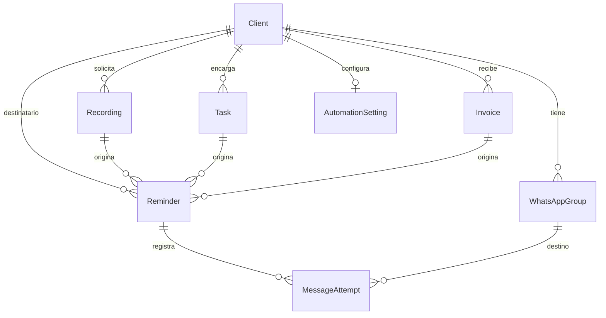
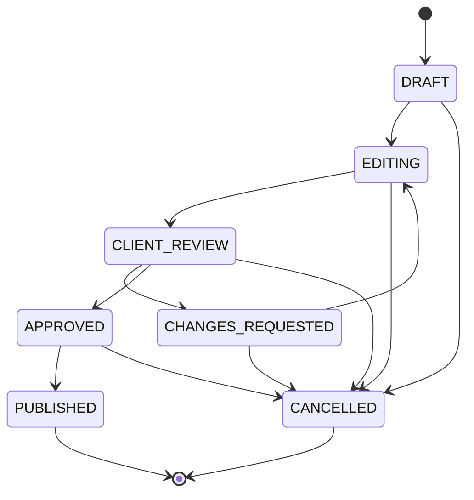
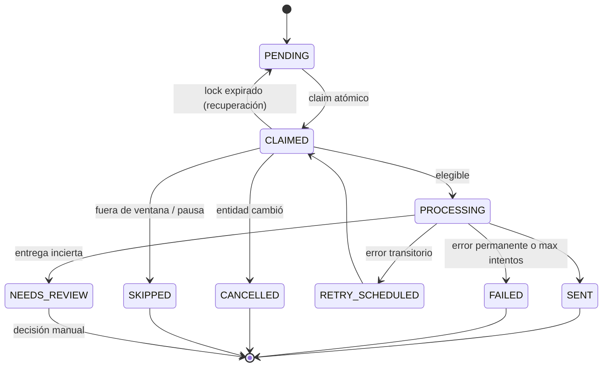

# docs/DOMAIN_MODEL.md — Modelo de dominio

## 1. Vista general

## 2. Entidades

### Client

Cliente de la agencia. Raíz de agregado para su configuración de automatización.

| Campo      | Tipo                               | Notas                                 |
| ---------- | ---------------------------------- | ------------------------------------- |
| `id`       | UUID v7                            |                                       |
| `name`     | string                             | nombre comercial, usado en plantillas |
| `status`   | `ACTIVE` \| `PAUSED` \| `ARCHIVED` | solo `ACTIVE` recibe recordatorios    |
| `timeZone` | IANA \| null                       | por defecto `America/Guayaquil`       |
| `notes`    | string \| null                     |                                       |

Invariantes: un cliente `ACTIVE` debe tener exactamente un `WhatsAppGroup` primario habilitado.

### WhatsAppGroup

Grupo privado existente. **No se crea ni se descubre automáticamente.**

| Campo          | Tipo                | Notas                                       |
| -------------- | ------------------- | ------------------------------------------- |
| `id`           | UUID v7             |                                             |
| `clientId`     | FK                  |                                             |
| `jid`          | string              | `<id>@g.us`. Único global                   |
| `label`        | string              | nombre interno legible                      |
| `isPrimary`    | boolean             | destino por defecto                         |
| `enabled`      | boolean             | interruptor de envío por grupo              |
| `authorizedAt` | timestamptz \| null | `OWNER_REQUIRED`: sin esto no se envía nada |

Invariantes: `jid` con formato de grupo (`@g.us`), nunca `@s.whatsapp.net` (individual).
Un grupo sin `authorizedAt` bloquea el envío aunque `enabled` sea `true`.

### Recording

Grabación programada.

`id`, `clientId`, `title`, `scheduledAt` (timestamptz), `durationMinutes?`, `location?`,
`notes?`, `status` (`SCHEDULED` | `RESCHEDULED` | `DONE` | `CANCELLED`), timestamps.

Invariante: reprogramar cambia `scheduledAt` y obliga a cancelar los recordatorios
pendientes ligados al `scheduledAt` anterior (la clave de idempotencia incluye el instante).

### Task

Tarea audiovisual.

`id`, `clientId`, `title`, `status` (`DRAFT` | `EDITING` | `CLIENT_REVIEW` |
`CHANGES_REQUESTED` | `APPROVED` | `PUBLISHED` | `CANCELLED`), `clientReviewEnteredAt?`,
`clientReviewRound` (int, empieza en 0), `dueAt?`, timestamps.

Transiciones válidas:

Cada entrada a `CLIENT_REVIEW` incrementa `clientReviewRound` y reinicia
`clientReviewEnteredAt`. La ronda forma parte de la clave de idempotencia, de modo que una
segunda ronda de revisión puede generar sus propios recordatorios sin colisionar.

### Invoice

`id`, `clientId`, `period` (`YYYY-MM`), `amountCents` (int), `currency` (`USD`),
`dueDate` (date), `status` (`PENDING` | `PAID` | `OVERDUE` | `CANCELLED`), `paidAt?`,
`remindersSent` (int), timestamps.

Invariantes: `PAID` ⇒ `paidAt` no nulo. `PAID`/`CANCELLED` ⇒ ningún envío.
Único por (`clientId`, `period`). Importes en enteros de centavos, nunca en coma flotante.

### Reminder

Unidad de trabajo del motor.

| Campo                                  | Notas                                                                                                           |
| -------------------------------------- | --------------------------------------------------------------------------------------------------------------- |
| `id`                                   | UUID v7                                                                                                         |
| `type`                                 | `RECORDING_24H`, `TASK_CLIENT_REVIEW_48H`, `INVOICE_UPCOMING_DUE`, `INVOICE_DUE_TODAY`, `INVOICE_OVERDUE`       |
| `clientId`                             | FK obligatoria (denormalizada para filtrar rápido)                                                              |
| `recordingId` / `taskId` / `invoiceId` | exactamente **uno** no nulo (`CHECK`)                                                                           |
| `targetGroupId`                        | grupo resuelto en el momento del envío, no de la programación                                                   |
| `scheduledFor`                         | timestamptz: cuándo **debe** enviarse (ya ajustado a la ventana)                                                |
| `status`                               | `PENDING`, `CLAIMED`, `PROCESSING`, `SENT`, `RETRY_SCHEDULED`, `CANCELLED`, `FAILED`, `SKIPPED`, `NEEDS_REVIEW` |
| `attempts` / `maxAttempts`             | contadores                                                                                                      |
| `claimedAt` / `claimedBy`              | lock cooperativo con expiración                                                                                 |
| `sentAt`                               | instante real de envío (distinto de `scheduledFor`)                                                             |
| `nextAttemptAt`                        | backoff                                                                                                         |
| `cancellationReason`                   | enum sanitizado                                                                                                 |
| `idempotencyKey`                       | string único global                                                                                             |
| `lastError`                            | mensaje sanitizado, longitud máxima                                                                             |
| `templateId` / `templateVersion`       | qué se envió                                                                                                    |
| `createdAt` / `updatedAt`              |                                                                                                                 |

Se añade `NEEDS_REVIEW` a los estados sugeridos: cubre el caso de **entrega incierta**
(proceso caído entre el envío y la confirmación). Sin él, el sistema tendría que elegir
entre duplicar o perder silenciosamente.

### MessageAttempt

`id`, `reminderId`, `groupId`, `attemptNumber`, `startedAt`, `finishedAt?`,
`status` (`STARTED` | `SUCCESS` | `FAILED` | `SKIPPED_DRY_RUN`), `templateId`,
`templateVersion`, `renderedLength` (int, no el texto completo), `providerMessageId?`,
`errorCode?`, `errorMessage?` (sanitizado), `durationMs?`, `correlationId`.

No se guarda el texto renderizado completo por defecto (PRI-03); se guardan las variables
usadas y la longitud. Configurable para depuración en desarrollo.

### AutomationSetting

Configuración global y por cliente. `id`, `clientId?` (null = global), `globalPaused`,
`businessHoursStart`, `businessHoursEnd`, `sendOnSundays`, `maxRemindersPerTask`,
`maxRemindersPerInvoice`, `taskReviewOffsetHours`, `invoiceOffsetsDays` (int[]),
`recordingOffsetHours`.

Resolución: valor del cliente → valor global → valor por defecto del código.

### AuditEvent

Trazabilidad de acciones sensibles. `id`, `occurredAt`, `actor` (`SYSTEM` | `CLI` | `OWNER`),
`action`, `entityType`, `entityId`, `metadata` (jsonb sanitizado), `correlationId`.

Acciones auditadas: vinculación/desvinculación de WhatsApp, autorización de grupo, pausa
global, cambio de configuración, cancelación manual, resolución de `NEEDS_REVIEW`.

## 3. Servicios de dominio (puros)

- `IdempotencyKeyFactory` — construye la clave determinista.
- `ReminderSchedulePolicy` — dado un origen y la configuración, devuelve las ocurrencias.
- `BusinessWindowService` — ajusta un instante a la siguiente ventana válida.
- `EligibilityService` — decide `SEND` | `CANCEL(reason)` | `SKIP(reason)` | `DEFER(until)`.
- `RetryPolicy` — decide si reintentar y calcula el backoff.
- `PhoneMasker` / `LogRedactor` — sanitización.

Todos reciben `Clock` y configuración por parámetro. Ninguno hace I/O.

## 4. Decisión de modelado del origen del recordatorio

Alternativas evaluadas:

| Opción                                            | Integridad referencial | Consultas                   | Extensibilidad                     | Complejidad |
| ------------------------------------------------- | ---------------------- | --------------------------- | ---------------------------------- | ----------- |
| A. Polimórfico (`sourceType` + `sourceId` sin FK) | ✗ ninguna              | media                       | alta                               | baja        |
| B. **Columnas opcionales + `CHECK`**              | ✓ FKs reales           | buena                       | media (una columna por tipo nuevo) | baja        |
| C. Tabla por tipo                                 | ✓                      | peor (UNION para el worker) | baja                               | alta        |
| D. Event sourcing                                 | ✓                      | compleja                    | alta                               | muy alta    |

**Elegida: B.** Con 3 orígenes y previsión de 1–2 más, las FKs reales y el `ON DELETE`
correcto valen más que la extensibilidad teórica de A. El worker consulta una sola tabla.
Registrado en [adr/0005-idempotent-reminders.md](adr/0005-idempotent-reminders.md).
